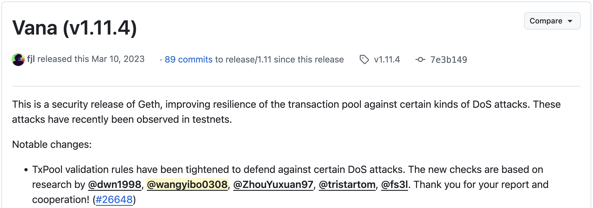
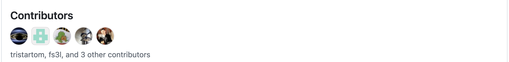



Discovering DoS attack on Ethereum transaction pool
---- 
- Discover the vulnerability of transaction pool in Ethereum clients by reading source code, testing cases and fuzzing.
- Report 12 unique attacks that can deny the service of transaction pool with 0 or low cost.
- Our team receives Bug bounty from Ethereum Foundation $12,000 (2021), $2,000 (2022), $4,000 (2023) and OpenEthereum/Parity $8,000 (2021)

Improving the resilience of the transaction pool against DoS attacks on [Go-Ethereum client](https://github.com/ethereum/go-ethereum)
---- 

- Design defense against transaction pool DoS attacks by tightening the TxPool validation rules. Ensure no vulnerability in our design of defense.
- Co-develop the patch code of the defense against transaction pool DoS attack and the code is merged in [Geth client *V1.11.4*](https://github.com/ethereum/go-ethereum/releases/tag/v1.11.4).
- Work as a contributor of Go-Ethereum (Geth) V1.11.4,
https://github.com/ethereum/go-ethereum/releases/tag/v1.11.4  

Cost optimization in blockchains
---- 

- Design a middleware system running on top of a blockchain network to optimize the cost of blockchain-based DApps.
- Achieve saving 14.6\% – 59.1\% Gas cost per invocation without losing security or causing extra delay.
- Implement smart-contract rewriting techniques on source/bytecode for the integration of the middleware with contract
